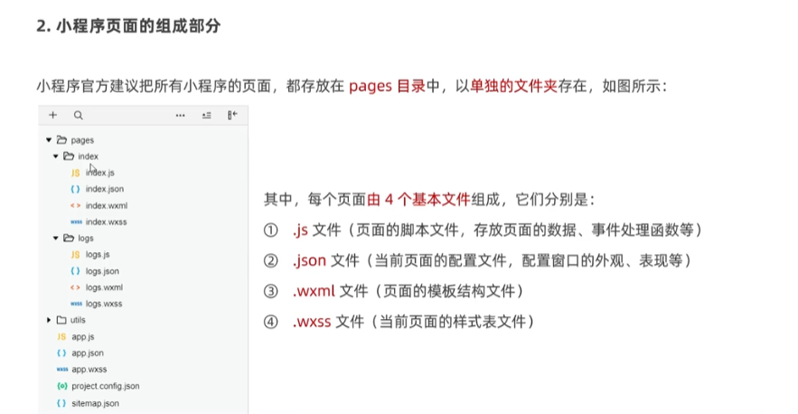

# 一.小程序简介
## 1.小程序与普通网页开发的区别
- 1.运行环境不同
  
  + 网页运行在浏览器环境中
  + 小程序运行在微信环境中

- 2.API不同
  ```txt
  由于运行环境的不同，所以小程序中无法调用DOM和BOM的API。但是，小程序中可以调用微信环境提供的各种API，例如：地理定位，扫码和支付
  ```
- 3.开发模式不听
  ```txt
  网页的开发模式：浏览器 + 代码编辑器
  小程序有自己的一套标准开发模式
    申请小程序开发账号
    安装小程序开发者工具
    创建和配置小程序项目 
  ```
## 2.注册小程序账号&安装开发者工具
- 1.使用浏览器打开https://mp.weixin.qq.com网址，点击【立即注册】即可进入到小程序开发账号的注册流程。
- 2.获取小程序的APPID：开发-开发设置，创建小程序项目的时候，需要用到APPID

## 3.小程序的代码构成
- pages:用来存放所有小程序的页面
- utils:用来存放工具性质的模块（例如：格式化时间的自定义模块）
- app.js:小程序项目的入口文件
- app.json:小程序项目的全局配置文件
- app.wxss:小程序项目的全局样式文件
- project.config.json:项目的配置文件
- sitemap.json:用来配置小程序及其页面是否被微信索引




```
不希望被微信索引的话讲allow改为disallow
```

